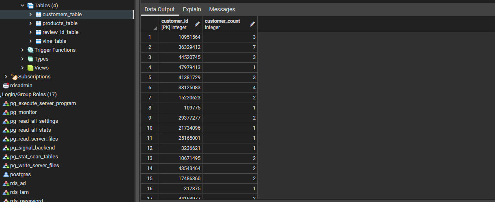
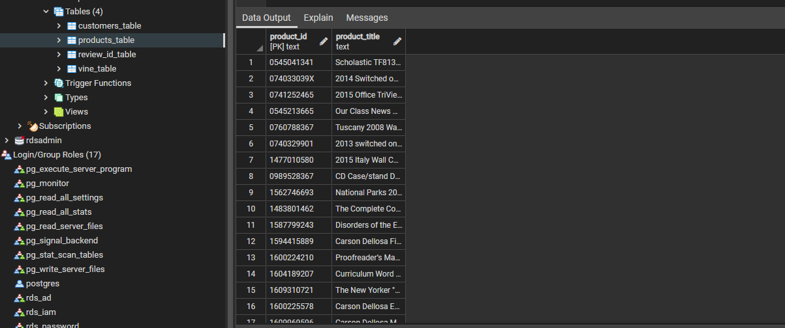
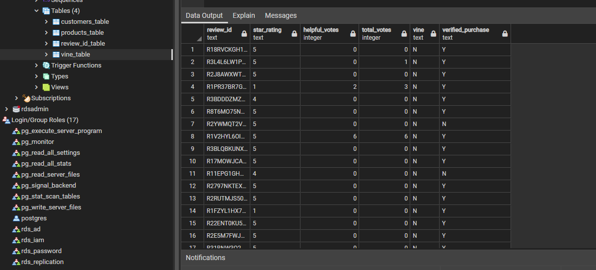
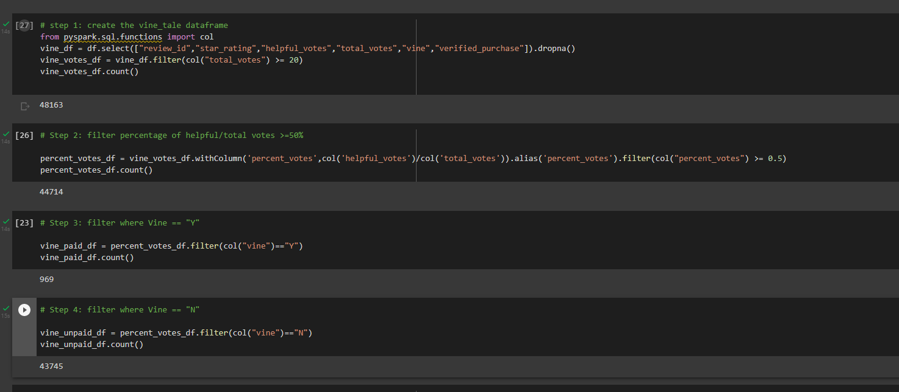
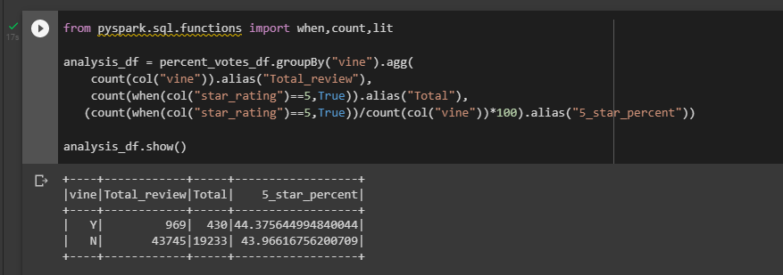

# Amazon_Vine_Analysis

## Overview
The goal of this analysis is to find Amazon written review of the office products by paid members of Amazon Vine program. This service allows manufacturers and publishers to receive reviews of their products and determine if there are any biases between Vine member’s and Non-Vine members’ reviews.

## Data and Tools

- Data: amazon_reviews_us_Office_Products_v1_00.tsv.gz
- ETL: PySpark
- Database: AWS RDS
- GUI: pgAdmin

Using PySpark to load data from an Amazon open-source data set into a colab workbook, extracting and transforming data into 4 designated tables, and then using PySpark to load target tables into AWS RDS, and verify loaded tables from pgAdmin.

## Results
- customers_Table
There are 1,790,276 records loaded into this table and contains customer's ID with total review counts; table structure is below:

- products_table
There are 313,279 records loaded into this table and contains product ID with products names; table structure is below:

- review_id_table
There are 2,642,434 records loaded into this table and contains review id with review id related information; table structure is below:

- vine_table
There are 2,642,434 records loaded into this table that contains review rating with votes information by Vine type; the table structure is below:

_ vine_table analysis

There are 48,163 review IDs that total votes over than 20 votes; There are 44714 review IDs in which helpful votes are over or equal to 50%. Within these helpful votes, there are 969 paid Vine review IDs and 43,735 unpaid review IDs.

## Summary

Based on the office products reviews analysis, rating results do not show bias between the paid and unpaid Vine members. To improve the analysis, we can assume that Vine customers are more critical when submitting their reviews. However, in order to support this assumption further, we should include all of the review IDs rather than filtering them to a percentage of helpful vs. total votes as we did for this analysis. Reviewing the data as is would give us more information and allow us to further support our assumption as shown below.

